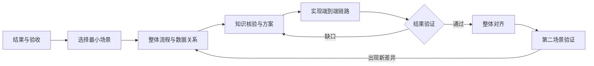
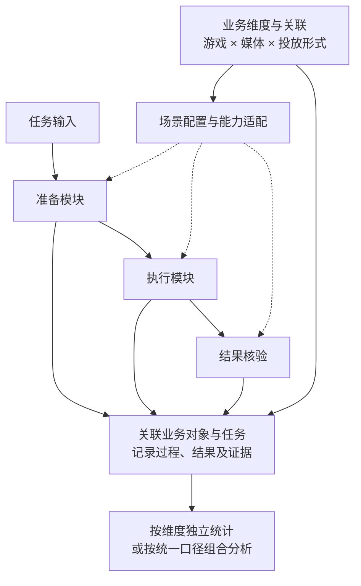

# Agent 项目从零开发：人机协作经验图谱

2026-09-16 · 方法参考 · 案例：marketing-workbench-v2

## 1. 需求理解

这份图谱帮助个人或小团队与 AI 开发协作者一起，把业务想法变成可验证、可维护、可扩展的 Agent。重点是开发中的判断顺序：先明确结果，走通一个窄场景，再按证据扩展。

**人负责目标、业务依据和关键取舍；AI 负责核验知识、发现缺口、提出方案、实现与验证。** 开发协作者 AI 与最终产品中的 Agent 是两个角色；产品采用规则、模型还是自主循环，需要另行判断。

下文历史事实来自 277 份 Task 及对应 Manifest；通用经验和重做顺序属于本文建议。v2 曾参考旧项目，不能视为毫无基础的从零实验。本轮未重跑历史业务，也不以任务关闭证明业务成功。

## 2. 项目演进带来的启示

按出现先后归并，部分区间重叠；早期日期精度见[复盘索引](../evidence/TASK-MWBV2-AGENT-DEVELOPMENT-EXPERIENCE-MAP-20260916/task-index.json)。

| 时间 | 任务记录中的关键变化 | 可迁移的经验 |
|---|---|---|
| 08-23 | 前端、API、数据库串通，确认与回查仍是[占位链路](../tasks/TASK-MWBV2-API-WORKFLOW-CLOSED-LOOP.md) | 明确这一轮验证了哪一层，保留真实验证缺口 |
| 08-24—27 | 真实接口暴露资料和概念缺口；人补充[媒体层级定义](../tasks/TASK-MWBV2-OE3-QIANKUN-MEDIA-TAXONOMY-CORRECTION.md)，纠正跨层比较 | 关键知识先核准，错误码和相似字段名不足以证明根因 |
| 08-26—28 | [统一节点定义](../tasks/TASK-MWBV2-WORKFLOW-NODE-REGISTRY-UNIFICATION.md)，随后[拆分开发协调与业务运行状态](../tasks/TASK-MWBV2-WORKFLOW-CASE-CONTROL-PLANE-REFACTOR.md) | 每类规则和事实明确所有者，局部修改回到整体核对 |
| 08-30—09-01 | [单变量验证记录](../tasks/TASK-MWBV2-OE3-JSZC-ONEOFF-CONVERTED-TIME-OMIT-CREATE-20260830.md)记载创建及回查成功；随后建设[工作台独立闭环](../tasks/TASK-MWBV2-WORKBENCH-NATIVE-PLAN-BOUND-CLOSURE-20260901.md) | 区分一次实验成功、正式链路完成和用户独立使用 |
| 09-08—10 | [任务合同检查](../tasks/TASK-MWBV2-PROJECT-CONTRACT-CHECKS-20260908.md)、启动协议精简和逻辑图整理 | 把反复出现的遗漏转为检查，按需提供上下文 |
| 09-13 | [移除正式流程的测试成功捷径](../tasks/TASK-MWBV2-UNIFIED-EXECUTION-20260913.md)，保留核心权限回归 | 测试替换外部依赖，仍验证正式判断；不虚报未完成的汇总回归 |
| 09-14—15 | [追加视频](../tasks/TASK-MWBV2-PROJECT-VIDEO-APPEND-20260914.md)复用确认与回查，随后修正完成状态收口 | 新场景检验模块复用，也暴露跨模块一致性问题 |

这些记录支持开发方法的提炼；追加事项复用并未证明多游戏、多媒体已全部适配，也没有形成开发效率提升的定量结论。

## 3. 如果重新开发，怎样推进

第一轮选择“单游戏 × 单媒体 × 单投放形式”，明确真实输入、最终结果、允许动作及失败停止方式。尽早核验最不确定的接口与业务前提，再完成整条链路。

**最小闭环有三个完成层次：**结构串通，证明输入可以到达输出；真实结果成立，证明真实数据和依赖下满足验收；用户可独立使用，证明正常操作、失败提示和恢复不依赖开发者临时改代码。按阶段标注完成层次，逐步验证可重复性。

每个里程碑检查：目标是否变化、上下游是否接通、数据来自哪里、失败由谁接管、当前文档与实现是否一致。新增场景、修改核心概念或同类故障反复出现时，立即重做这次整体对齐。

## 4. 七个通用核心维度

| 维度 | 必须想清楚的问题 | 最小产物 |
|---|---|---|
| 目标与验收 | 谁使用？交付什么？如何证明完成？时间和人工投入能否接受？ | 场景卡、代表样例和通过标准 |
| 整体逻辑 | 输入如何变成结果？哪些步骤固定，哪里需要模型判断？ | 一张主流程图，标出依赖与停止点 |
| 知识依据 | 哪些业务概念、规则、接口尚不确定？来源是否适用？ | 带来源、版本、适用范围的关键知识清单 |
| 人机职责 | 什么由人决定，什么可由 AI 自主完成？ | 决策点、执行范围和接管条件 |
| 模块与变化维度 | 哪些部分稳定？增加对象、渠道或形式时哪里会变？ | 模块输入输出、变化点与适配方式 |
| 数据与报表 | 一条记录代表什么？归属谁？以后按什么维度看结果？ | 实体关联、记录粒度和指标口径草图 |
| 验证与迭代 | 正常、缺失、失败、中断时怎样判断？变更是否退化？ | 验收证据、回归样例和经验记录 |

关键环节先整理“已知事实—待核实项—来源—约束”，再输出包含取舍、影响范围、验证与停止条件的方案。人提供业务语义和已有权威资料，AI 主动核验补齐；发现冲突时暴露差异，暂不固化猜测。上下文只装入当前任务需要的材料，已验证经验注明适用与失效条件。

## 5. 范围做小，模块与数据保留扩展空间

下图是重新设计类似项目时的思考模型，不是当前项目的数据库改造方案。每个模块明确输入、输出、依赖、权限与验证方式，模块也不必对应独立 Agent 或服务。

**先识别变化维度，首版实现一个有效组合。** 参数不同优先配置化；接口或能力不同增加适配；流程与验收不同再调整编排。以第二种组合检验边界，保留已有场景回归，避免为尚未出现的需求建设完整平台。有效组合也需要约束，不能假定各维度可以任意组合。

数据库设计时先问：游戏、媒体、投放形式是什么关系？业务对象、一次运行、一次动作、一次核验各代表什么？哪些是配置，哪些是发生过的事实？如何关联而不互相覆盖？

报表需求也应提前进入讨论：按游戏、媒体、形式、用户、时间分别看什么；统计任务还是尝试次数；成功依据、去重、时间口径和权限是什么。按维度独立统计可以复用共同事实；是否分表由记录粒度和职责决定。流程成功率与业务效果需要各自的数据来源，单有执行记录无法计算投放收益。当前项目的数据说明见[数据与报表契约](project-数据与报表契约.md)，本节不新增其统计规则。

## 6. 各阶段的人机分工与通过标准

| 步骤 | 人负责 | AI 负责 | 产物与通过标准 |
|---|---|---|---|
| 定义目标 | 说明使用者、价值和边界 | 澄清歧义，提出验收样例 | 双方能判断成功与失败 |
| 选择闭环 | 选定首个业务组合 | 画全链路，识别高风险依赖 | 输入可得，结果可查，投入有界 |
| 知识与方案 | 提供依据，决定关键取舍 | 查缺补漏，比较最小方案 | 未知项和停止条件可见 |
| 分步开发 | 处理业务决策与必要授权 | 按有验收的小任务实现、验证 | 每步输出可被下游使用 |
| 真实验收 | 判断业务结果及使用体验 | 核对实际产物、异常与恢复 | 标明已证明的完成层次 |
| 整体对齐 | 确认目标和范围变化 | 同步逻辑、数据、文档与回归 | 当前规则有唯一入口 |
| 扩展与沉淀 | 选择下一场景及优先级 | 验证复用边界，保留旧场景检查 | 新旧场景均通过，经验有适用范围 |

迁移到研究 Agent，结果核验侧重原文证据与结论；编程 Agent 侧重测试和实际行为；业务执行 Agent 还需核验授权、外部状态及重复动作。根据任务选择固定流程或有边界的自主探索，分别设置反馈和停止方式。固定七节点、Postgres、多 Agent 都不是采用本方法的前提。

方法参考：[人-agent分类及理解方法论v1](/Users/hys/knowledge/01-个人本地知识库/03-人机协作与方法论/1-human-AI/人-agent分类及理解方法论v1.md)；案例当前机制：[项目逻辑图](project-现在的逻辑图.md)。[复盘依据与局限](../evidence/TASK-MWBV2-AGENT-DEVELOPMENT-EXPERIENCE-MAP-20260916/source-review.md)单独留存，便于追溯。

## 7. 最小文档与推进机制

开发这类 Agent，可把准备工作收束为**四类设计依据、四类推进机制**。下表将前述七维度映射到文件职责；人机分工、模块扩展和验证嵌入其中。先写足够推进当前闭环的内容，文件名随项目调整。

选型时分别看**工作形态、内部架构与运行责任**；研究、编程或业务执行的名称，不直接决定架构。分类依据见[方法论第 2、6、7 节](/Users/hys/knowledge/01-个人本地知识库/03-人机协作与方法论/1-human-AI/人-agent分类及理解方法论v1.md#maps)。

| 核心事项 | 文档或机制（对应本项目） | 简洁定位 |
|---|---|---|
| 目标与方案 | 方案设计 → [Solution Design.md](Solution%20Design.md) | 明确目标与验收；选择固定、动态或混合控制及复用、自建边界，记录人决定的取舍与代表任务 |
| 整体逻辑 | 整体逻辑图 → [当前逻辑图](project-现在的逻辑图.md) | 输入如何成为结果；标出模块输入输出、变化点、模型与规则分工、人工决策；引用工具合同，明确核验、停止和恢复方式 |
| 知识与上下文 | 知识索引与权威资料 → [资料入口](Solution%20Design.md#资料使用) | 标明来源、版本、适用范围和待核实项；区分长期资料与当前上下文，跨任务记忆按复用需要引入 |
| 数据、运行状态与报表 | 数据与报表设计 → [数据契约](project-数据与报表契约.md) | 明确实体关系、粒度、归属、来源、读写责任和历史；区分业务事实与产品运行进度，设计等待、结果待确认等状态；按需约定统计口径 |
| 协作约定 | [AGENTS.md](../AGENTS.md) | 规定启动顺序、真值来源、人机权限边界和任务收尾方式 |
| 项目状态 | [project.state.json](../project.state.json) | 保存项目生命周期、当前任务指针、最近关闭任务引用及全局边界 |
| 任务闭环 | [tasks](../tasks/) + [tasks-context-manifests](../tasks-context-manifests/) + [evidence](../evidence/) | Task 写目标与验收；Manifest 管状态、必读上下文、允许范围与验证记录；evidence 留实际证据 |
| 运行与检查 | [package.json](../package.json) 等项目配置 | 提供统一启动、运行和检查入口；本项目用 Node scripts，其他技术栈采用对应配置 |

知识准备可从一份索引和少量可靠资料开始，不默认建设复杂知识库系统。人提供业务依据，AI 核验补齐，再形成可选择的方案。表中链接复用当前权威文件，具体规则在原文件维护。

这里的 Task/Manifest 管开发任务；产品中的 Agent 另需运行状态与结果记录。AGENTS 和 package 分别提供协作约定与命令入口，产品权限、停止和恢复由执行机制落实。数据设计需要考虑，数据库和业务报表按需建设；个人研究可先用文件保存来源与产物。

工具合同至少说明实际可用性、输入、返回、错误、副作用与权限。任务需有时间、费用及无进展时的停止边界；外部动作结果不明时，先核对实际状态，再按授权决定恢复或交人处理。

**按场景条件选择架构起点：**

| 场景条件 | 最小架构起点 | 特别关注 |
|---|---|---|
| 路径固定，结果容易检查和修正 | 脚本或工作流，必要处调用模型 | 数据校验、输出正确性 |
| 路径固定，涉及外部业务写入 | 工作流＋执行权限＋结果核验 | 授权、重复动作、结果待确认 |
| 路径开放，交付物可审阅 | 有工具和边界的单 Agent | 证据、反馈、预算、停止条件 |
| 路径开放，错误后果难以撤销 | 受控流程＋局部自主探索 | 自主范围、人工接管、实际状态核验 |

这些是按场景判断的默认起点，不是互斥类型或升级等级。长任务补持久状态与恢复；独立分工确有收益时补多 Agent 委托与汇总；多用户补身份和数据隔离；实时交互补延迟与打断处理。这些条件可以叠加。

用代表任务比较质量、耗时、费用与人工投入，结果进入任务证据；上线时明确失败处理、维护负责人和版本回退，记录在按需补充的部署说明中。本项目的流程与授权经验可迁移，固定节点、数据库及任务目录不作为通用架构要求。

**推进顺序：明确结果 → 判断自主范围与运行约束 → 画最小闭环 → 核准知识、工具与数据 → 实现和验证 → 对齐全局 → 检验扩展。**

维护时坚持三点：

- 每项规则或事实只有一个权威位置，其他文件引用；业务运行事实由运行系统保存，开发任务状态单独管理。
- 任务开始按需读，关键变化及时对齐，结束留下证据；检查命令通过后，仍按验收标准核对真实结果。
- 首版实现一个有效组合，模块明确输入输出并预留变化点；需要交付运行时补部署说明，有已验证的复用结论时再补经验库。
