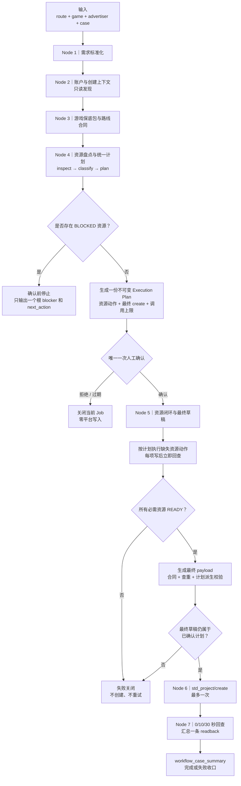
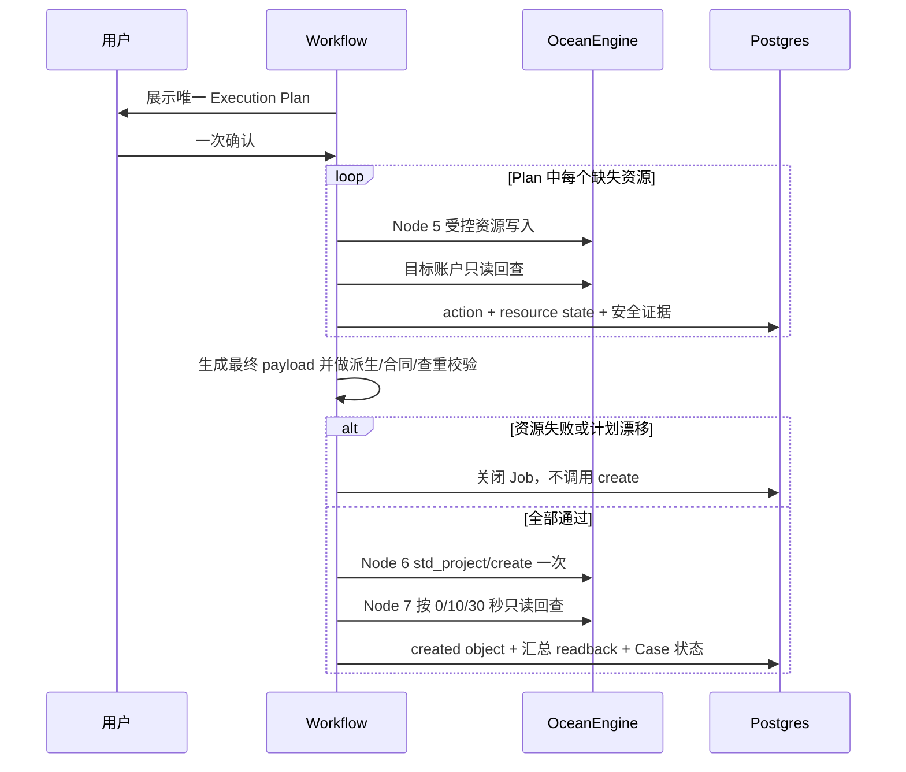

# marketing-workbench-v2｜project-最合理的逻辑图

> 文档性质：目标态逻辑设计，不替代当前运行真值。
>
> 当前实现仍以 `src/workflows/skills/oe3/00-workflow-node-registry.mjs`、Postgres、active Task / Manifest 为准；[project-逻辑图.md](./project-逻辑图.md) 记录当前机制，[project-lessons.md](./project-lessons.md) 记录已验证经验。

## 1. 校正结论

对比当前机制后，最合理的方案不是重做 Node 1–7，而是在原有主干上做一次职责校正：

```text
保留：Node 1 输入 → Node 2 上下文 → Node 3 游戏包
校正：Node 4 只做资源盘点和完整执行计划
确认：Node 4 后只进行一次人工确认
校正：Node 5 执行已确认的资源动作并生成最终创建草稿
保留：Node 6 只执行一次 std_project/create
保留：Node 7 只做创建结果回查和 Case 收口
```

核心原则只有三条：

1. **模块独立**：每类资源各自查找、准备、回查，禁止互相替代。
2. **计划合并**：所有必要资源动作和最终 create 合并成一份 Execution Plan。
3. **只确认一次**：用户一次确认整份计划；执行中不追加确认、不扩大范围、不自动重试。

## 2. 最终主流程



整条链只有一个人工 Gate。Node 5 可以包含多个已确认的资源写入，但 Node 6 始终只负责创建项目，不承担资源编排。

## 3. Node 1–7 的唯一职责

| Node | 唯一职责 | 输出 | 不做什么 |
|---|---|---|---|
| Node 1 | 固定本次业务意图 | route、game、advertiser、case、预算/出价/排期 | 不访问平台资源 |
| Node 2 | 只读发现账户上下文 | 账户、授权、token 状态、监测/触点、平台 App | 不在确认前创建监测或刷新 token |
| Node 3 | 读取游戏与路线配置 | 默认业务参数、素材包、资源蓝图、字段合同 | 不读取历史请求填充当前账户 ID |
| Node 4 | 汇总上下文缺口、盘点全部资源并编译一份执行计划 | resource matrix、root blocker 或 Execution Plan | 不执行平台写入，不生成多个资源确认 |
| Node 5 | 执行计划内资源动作并生成最终草稿 | READY 资源集合、payload hash、wire hash、查重和合同结果 | 不扩展已确认计划，不创建项目 |
| Node 6 | 原子执行一次标准项目创建 | create action、created object | 不准备资源、不重试、不创建 Promotion |
| Node 7 | 回查创建对象并关闭业务闭环 | 0/10/30 汇总 readback、Case 最终状态 | 不补发 create，不修改资源 |

这比第一版目标图更清晰：Node 5 负责“把创建条件变成完整草稿”，Node 6 只负责“发送完整草稿一次”。

## 4. 所有资源共用一个接口

每个资源 Skill 都应遵循同一条最小接口，不再各自发明流程：

```text
inspect(context)
  → 查询游戏级来源和目标账户即时状态

classify(evidence)
  → READY | PLANNED | BLOCKED

plan(evidence)
  → 缺失且 prepare_supported=true 时生成确定动作

execute(action)
  → 仅 Node 5 在整份 Plan 已确认后调用

verify(result)
  → 目标账户真实只读回查，最终只能得到 READY 或失败
```

### 4.1 三个状态已经足够

| 状态 | 含义 | 后续行为 |
|---|---|---|
| `READY` | 目标账户本轮已回查可用 | no-op，直接供 Node 5 组包 |
| `PLANNED` | 当前缺失，但正式 executor、来源、合同和回查均已验证 | 纳入唯一 Execution Plan，确认后由 Node 5 执行 |
| `BLOCKED` | 缺少授权、来源、官方能力、正式 executor 或可靠回查 | Node 4 停止，只输出最前置根因 |

不要再增加 `missing`、`unsupported`、`needs_confirmation`、`prepareable` 等并列业务状态。它们应当作为 `reason_code` 或能力属性，而不是新的流程状态。

判定公式固定为：

```text
目标账户已验证可用
  → READY

目标账户缺失
  + prepare_supported=true
  + 正式 executor/readback 已验证
  + 来源、数量、hash 明确
  → PLANNED

其他情况
  → BLOCKED
```

数据库中“曾保存”“历史可用”“来源账户可见”都不能单独得到 `READY`。

## 5. 各模块按 `project-lessons` 归位

| 模块 | 来源/归属 | 标准动作 | 当前未闭环时的处理 |
|---|---|---|---|
| 账户、token、抖音号授权 | 目标账户 | 只读核验 | 不通过即 `BLOCKED`；不自动换号或刷新 token |
| 监测与触点 | 目标账户 + 受控配置 | 查找；正式 ensure 能力成熟后可计划创建并回查 | 未进入统一 executor 前为 `BLOCKED` |
| 头像 | 游戏级本地头像 → 目标账户 | 上传 → 提交 → 回查 | 已验证 executor 可进入 `PLANNED` |
| DMP | 物料户保底包 → 目标账户 | 查源/目标 → 仅推送缺失成员 → 整组回查 | 已验证 executor 可进入 `PLANNED` |
| 视频 | 物料户 → 目标账户 | 源回查 → bind → 目标回查 | 已验证 executor 可进入 `PLANNED` |
| 产品图 | 游戏级源文件 → 目标账户 | 查找 → 上传或正式绑定 → 回查 | 目标写入闭环未验证前为 `BLOCKED` |
| 品牌 | 目标账户品牌/行业库存 | 只读核验 | 当前 `prepare_supported=false`，缺失即 `BLOCKED` |
| 小游戏实例 | 组织/目标账户可用事实 | 实例、app、调起关系和优化目标组合回查 | 自动绑定/创建未验证前，缺失即 `BLOCKED` |
| 事件与 PAY/7 日 ROI | 目标账户 + 小游戏实例 | 事件资产、优化目标、深度目标组合回查 | 创建/配置 executor 未验证前，缺失即 `BLOCKED` |
| 备用落地页 | 游戏级默认页 → 目标普通/共享库存 | 源回查 → 目标查找 → 共享后回查 | 官方自动分享 executor 未验证前，缺失即 `BLOCKED` |
| 标题、卖点、CTA、小游戏链接 | 游戏包/路线合同 | 读取并做数量、类型、hash 和协议校验 | 不产生资源写入；不合规则 `BLOCKED` |

这张表只表达机制边界，不声称尚未验证的能力已经存在。未来某模块完成正式 executor、合同测试和真实回查后，只需把它的 `prepare_supported` 从 false 升为 true，不需要改 Node 1–7 主流程。

## 6. 一次确认到底确认什么

新账户可能在确认后才得到头像、DMP、视频或产品图的目标资源 ID，因此唯一确认不应强行绑定一份尚不存在的最终 payload。它应绑定：

- 目标账户、路线、游戏和 Case；
- 精确项目名及业务参数；
- 预算、CPA、ROI、排期和即时投放风险；
- 每个资源的来源、类型、数量和内容 hash；
- 全部计划动作及依赖顺序；
- 每项动作的最大平台调用数和总调用上限；
- 最终 `std_project/create=1`；
- 成功字段合同版本和字段形态 hash；
- 禁止自动重试、Promotion、计划外写入和隐式 token 刷新；
- Job ID、Execution Plan ID 和 plan hash。

Execution Plan 中只需要两类动作：

```text
ensure_resource:<resource_type>
create_std_project
```

内部一次 API 调用还是多步 API 调用，由对应资源 executor 的合同限定。例如头像是“上传 + 提交 + 回查”，DMP 是“逐缺失成员推送 + 整组回查”；这些内部步骤不再产生额外人工确认。

## 7. Node 5 如何在不二次确认的情况下生成最终 payload

Node 4 的 Plan 固定“业务值、资源来源和数量”，Node 5 只允许把执行结果填入对应资源槽位：

```text
confirmed plan
  + Node 5 本轮资源 action/readback 结果
  + 当前路线唯一字段合同
  → final payload
```

Node 5 完成后生成：

- `final_payload_hash`
- `wire_hash`
- `resource_set_hash`
- 字段合同和字段形态校验结果
- 同名查重结果

Node 6 不要求第二次确认，但必须验证最终草稿是已确认 Plan 的确定性派生结果：

- 动态资源 ID 全部来自本计划的 `READY` 证据或 Node 5 写后回查；
- 资源类型、来源、数量和内容 hash 未变化；
- 预算、出价、ROI、排期、定向、素材内容和项目名未变化；
- 字段形态符合路线成功合同；
- 实际动作和平台调用没有超过计划上限；
- 同名查重仍通过。

任一项不满足，当前 Job 直接失败关闭。不能修改 Plan、不能弹出第二次确认、不能继续 create。

## 8. 执行和失败规则



统一停止规则：

- 任何必要资源失败，停止剩余写入并禁止 create。
- 平台已受理但暂未可见，只按该资源已验证的回查窗口继续只读查询；不重复写入。
- create 超时、业务失败或回查未命中，禁止第二次 create。
- 已成功准备的资源保留为账户事实；下次 fresh Job 重新发现为 `READY`。
- `workflow_case_summary` 只展示最前置根 blocker 和一个 `next_action`，不展示下游派生 blocker 洪水。

## 9. 最小数据链

```text
L1 路线/游戏配置
  +
L2 目标账户即时资源事实
  ↓
L3 workflow_case
  ↓
L4 runtime Job：Node 1–4
  ↓
1 Execution Plan
  ↓
1 Confirmation
  ↓
Node 5：N 个资源 actions + 最终 Draft
  ↓
Node 6：1 个 create action + created object
  ↓
Node 7：1 条 0/10/30 汇总 readback
  ↓
workflow_case_summary
```

一个 confirmation 可以授权同一 Plan 下多个 `platform_actions`，但每条 action 仍必须独立保存：

- action type 和 target advertiser；
- idempotency key；
- 输入安全 hash；
- 最大调用数；
- 执行状态和回查证据。

“一次确认”只合并人工 Gate，不合并动作级审计。

### 9.1 唯一需要调整的授权数据合同

当前机制是“最终 Draft / payload hash → Plan → Confirmation → create”。新账户若要在整个 Node 1–7 只确认一次，就必须调整为：

```text
Node 4 intent/action plan hash
  → Confirmation
  → Node 5 resource actions
  → final payload hash + derived-from-plan 校验
  → Node 6 create grant
```

因此目标数据合同应明确：

- `launch_execution_plan` 在 Node 4 后冻结，保存业务意图、资源动作、调用上限和 plan hash；
- `launch_confirmation` 只绑定这份不可变 plan hash；
- Node 5 的最终 Draft 保存 `final_payload_hash`，并引用其来源 plan hash；
- Node 6 grant 同时检查确认有效、派生校验通过、create attempt 未消耗；
- final payload 不能反向修改已确认 Plan。

这是实现一次确认所需的核心合同变化；不需要新增第二套 Plan，也不需要给每种资源保留独立 confirmation。

## 10. 相对当前机制只改四件事

| 当前机制 | 目标修正 |
|---|---|
| Node 4 同时混合只读核验、准备计划和外部资源 Task | Node 4 统一为只读盘点与一份计划 |
| 每个资源写入独立 Plan、独立确认，最后 create 再确认 | 整个 Job 只有一份 Plan、一次确认 |
| Node 5 只有资源全 ready 才能开始 | Node 5 在确认后先执行计划内资源闭环，再生成最终草稿 |
| Node 6 当前只 create | 保持不变，禁止把资源准备塞入 Node 6 |

不需要改变的部分：

- 7 个 Node 的唯一注册表；
- Case、Job、Node、Skill 的审计主链；
- 游戏级配置和账户级资源两层真值；
- Node 5 的共享 payload/nested contract；
- Node 6 单次 create 原子 claim；
- Node 7 创建结果回查；
- raw payload、完整 URL、token 和 raw response 不落库的安全边界。

## 11. 实施顺序

1. 统一 Node 4 资源输出为 `READY / PLANNED / BLOCKED + reason_code + evidence_ref`。
2. 为每个资源能力声明 `prepare_supported`、executor、verify、最大调用数和依赖。
3. 扩展一份 Execution Plan，使其同时容纳资源动作和最终 create。
4. 将唯一人工确认移动到 Node 4 计划完成之后。
5. 让 Node 5 消费确认后的资源动作，写后回查，再调用现有 payload builder/contract/preflight。
6. 调整 Plan / Confirmation / execution grant 数据合同，证明最终草稿由已确认 Plan 确定性派生。
7. 保持 Node 6 只执行一次 create。
8. 收敛 `workflow_case_summary`，只输出一个根 blocker。
9. 先用 fake transport 验证，再用新账户做一次正式 Node 1–7 认证。

目录重构、历史脚本归档和 npm 命令精简不与这次主流程改造混做。

## 12. 验收标准

- 一个 runtime Job 只有一份有效 Execution Plan 和一条有效人工确认。
- Node 1–4 零平台写入。
- `BLOCKED` 资源在人工确认前停止。
- Node 5 只能执行 Plan 已列明的资源动作；每项写后必须回查。
- 资源准备失败时，Node 6 的 create action 数量为 0。
- Node 5 最终草稿通过成功字段合同、计划派生校验和同名查重。
- Node 6 仍只有一次 `std_project/create`，失败不重试。
- Node 7 只生成一条包含 0/10/30 三次结果的汇总 readback。
- 所有资源 action 与 create action 共享同一 confirmation，但各自保留幂等键、调用上限和证据。
- 7 个 Node、正式 Skill、Plan、Confirmation、Actions、Created Object 和 Readback 审计链完整。
- 不创建 Promotion、不修改计划外预算或出价、不隐式刷新 token。
- `workflow_case_summary` 最终只输出完成状态，或一个最前置根 blocker。

最终用户体验应当只有：

```text
选择账户和游戏
→ 系统查清全部资源并生成一份完整计划
→ 用户确认一次
→ 系统准备缺失资源、逐项回查、生成草稿、创建一次、三次回查
→ 完成；或在首个不可恢复问题处安全停止
```
