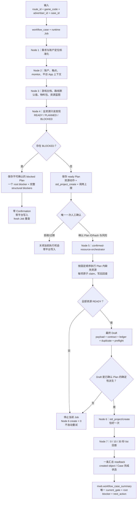

# marketing-workbench-v2｜项目当前逻辑图

> 文档性质：当前唯一 OE3 后端机制的静态说明。
>
> 节点与 Skill 以当前代码为准；账户、Case、Job、资源和平台动作的实时状态只看 Postgres `marketing_workbench_v2.mwb`，不得从本文恢复运行事实。

## 1. 当前结论

项目已经收敛为一条正式主链：

```text
输入
→ Workflow Case
→ runtime Job
→ Node 1–4 只读发现与统一计划
→ 一份不可变 Execution Plan
→ 一次人工确认
→ Node 5 资源闭环与最终 Draft
→ Node 6 一次 std_project/create
→ Node 7 三次只读回查
→ workflow_case_summary 收口
```

唯一节点来源：

```text
src/workflows/skills/oe3/00-workflow-node-registry.mjs
```

唯一运行入口链：

```text
frontend / API / CLI
→ launchWorkflow
→ workflow-node-registry
→ OE3 runner
→ Node 01–07 Skills
→ platforms / repositories
→ Postgres
→ mwb.workflow_case_summary
```

不存在第二套 Node、第二套 payload builder 或 one-off 正式创建路径。

## 2. 一张图看完整流程



## 3. Node 1–7 的职责边界

| Node | 当前唯一职责 | 主要输出 | 硬边界 |
| --- | --- | --- | --- |
| Node 1 `launch_intake` | 固定路线、游戏、广告主和 Case | 标准化业务定位 | 不访问平台资源，不写平台 |
| Node 2 `creation_context` | 装配账户、受控触点、monitor、平台 App | 创建上下文与只读证据 | monitor 缺失时阻断；不把未接入统一 registry 的 monitor 创建塞入正式 Plan |
| Node 3 `game_launch_pack` | 读取游戏主档、路线默认值、物料包、备用页基线、资源蓝图 | 游戏级创建保底包 | 不从历史请求恢复目标账户 ID |
| Node 4 `account_resource_prepare` | 对全部必需资源执行只读发现和三态分类，编译一份 Plan | resource states、Plan、root blocker | 确认前零平台写入；`BLOCKED` 时 Plan 不可确认 |
| Node 5 `std_project_draft_builder` | 消费已确认 Plan，执行受支持资源动作，写后回查，生成最终 Draft | payload hash、字段合同、字段账本、查重、preflight | 不扩大 Plan，不追加确认，不创建项目 |
| Node 6 `std_project_create_executor` | 原子 claim 并调用一次创建接口 | create action、created object | 不准备资源，不重试，不创建 Promotion |
| Node 7 `readback_closer` | 对精确项目执行三次只读回查并收口证据 | 一条汇总 readback、Case 结果 | 不补发 create，不修改预算、出价或资源 |

`dry_run` 在 Node 4 被阻断时仍可生成 Node 5 结构诊断，供 `structural_blocker_codes` 取证；这些诊断不是可执行授权，也不会越过 Node 4 的 root blocker。

## 4. Node 4：统一资源模型

所有资源 Skill 只向 Workflow 暴露三个状态：

```text
目标账户本轮已回查可用
→ READY

目标账户缺失
+ prepare_supported=true
+ executor、来源、官方合同、回查均已实现
→ PLANNED

其他情况
→ BLOCKED
```

| 状态 | 含义 | Plan 行为 |
| --- | --- | --- |
| `READY` | 当前目标账户已经真实只读验证可用 | no-op，作为 Node 5 组包输入 |
| `PLANNED` | 当前缺失，但正式 executor 可以在确认后闭环 | 生成一个 `ensure_resource:*` 动作 |
| `BLOCKED` | 缺来源、授权、官方能力、正式 executor 或可信回查 | Plan 为 `blocked`，不生成 Confirmation，不允许任何平台写入 |

当前正式 registry 中可进入 `PLANNED` 的资源只有：

| 资源 | Plan 动作 | 正式 executor | 写入上限 |
| --- | --- | --- | --- |
| 头像 | `ensure_resource:avatar` | `oceanengineAvatarExecutor.mjs` | 最多上传 1 次、提交 1 次 |
| DMP 排除人群包 | `ensure_resource:dmp_audience_package` | `oceanengineDmpExecutor.mjs` | 只推送 fresh plan 中缺失成员 |
| 视频 | `ensure_resource:video_asset` | `oceanengineVideoMaterialExecutor.mjs` | 一次批量绑定当前要求素材 |
| 产品图 | `ensure_resource:product_image` | `oceanengineProductImageExecutor.mjs` | 最多上传 1 张 |

当前只能 `READY` 或 `BLOCKED`、不能自动准备的资源：

| 资源 | 当前边界 |
| --- | --- |
| 事件资产与优化目标 | 只读核验事件、PAY 与深度 ROI 链；缺失时 `BLOCKED` |
| 品牌信息 | 只读核验目标账户可用性；缺失时 `BLOCKED` |
| 小游戏实例 | 只读核验实例、应用、账户与目标链；缺失时 `BLOCKED` |
| 备用落地页 | 只读核验普通/共享库存、HTTPS、active 与 hash；分享 executor 尚未正式启用，缺失时 `BLOCKED` |

`prepare_supported=false` 是能力边界，不是临时错误。只有官方写接口、单次 executor、幂等策略和写后回查都验证完成，资源 registry 才能升级为 `prepare_supported=true`。

## 5. Execution Plan 与唯一 Confirmation

Node 4 持久化的 Plan 是整次执行的唯一授权合同。

### 5.1 无外部 blocker 时

一份 `ready` Plan 同时包含：

```text
0..N 个 ensure_resource:<resource_type>
+ 恰好 1 个 std_project_create
```

Plan 固定：

- Job、Case、广告主、路线和游戏；
- 精确项目名及业务意图 hash；
- 预算、CPA、ROI、排期；
- Node 4 的资源三态、目标资源类型和计划动作；
- 每个 action 的 idempotency key、依赖、最大平台调用数；
- `std_project_create` 最大调用数为 1；
- `retry_allowed=false`；
- 成功合同版本与字段形态摘要。

### 5.2 有外部 blocker 时

仍保存一份审计用 `blocked` Plan：

- 可列出已经确认有 executor 的未来资源动作；
- 不包含可执行的 `std_project_create`；
- 不可产生 Confirmation；
- 不可触发任何资源或创建写入；
- `workflow_case_summary` 只投影一个最前置 root blocker；
- 全部下游和结构问题留在 `structural_blocker_codes`，不污染当前 next action。

### 5.3 唯一确认

人工确认只发生一次，绑定：

```text
job_id
+ plan_id
+ plan_hash
+ advertiser_id
+ 精确项目名
+ 预算 / CPA / ROI / SCHEDULE_FROM_NOW 风险
+ 全部资源动作及调用上限
+ std_project_create = 1
+ 禁止重试 / Promotion / 隐式 token 刷新
```

Confirmation 状态为 `confirmed_for_execution_plan`。确认后 Plan 原子冻结；重新编译、覆盖、Plan hash 漂移或业务参数变化都直接阻断。

## 6. Node 5：确认后的确定性派生

Node 5 的正式顺序固定为：

```text
confirmed-resource-orchestrator
→ 头像
→ DMP 缺失成员
→ 视频绑定
→ 产品图
→ 每项写后目标账户回查
→ payload-build
→ payload-contract
→ duplicate-check
→ create-readiness
```

每个资源动作都必须满足：

```text
当前 Plan/Confirmation/hash 匹配
+ action 已列入 Plan
+ 目标账户一致
+ action 尚未消费
+ 平台调用数不超上限
+ retry_allowed=false
```

最终 Draft 无需第二次确认，但必须证明是已确认 Plan 的确定性派生：

- 项目名、预算、CPA、ROI 不变；
- 动态资源 ID 只来自确认前 `READY` 证据或本 Plan 的写后回查；
- payload 保存 `derived_from_plan_id/hash`；
- 字段合同、字段形态、字段账本、wire 编码和同名查重全部通过。

当前直接派生比较覆盖项目名、预算、CPA、ROI 与 Plan ID/hash。排期、资源集合、数量和字段形态由不可变 Plan、动作 scope、资源回查、payload contract 与成功配置共同约束；尚未单独形成一个覆盖所有动态资源槽位的 `resource_set_hash`。这是后续可继续加固的审计精度，不应被表述为当前已经完成的直接 hash 比较。

任一资源失败或 Draft 漂移，当前执行立即停止，Node 6 的 create action 必须为 0。

## 7. JSZC/BYTE_GAME 当前成功合同

正式 Node 5 使用：

```text
successProfileVersion
= 2026-08-30.jszc-byte-game-success-profile-v1

goldenFieldShapeHash
= sha256:9203ddf077d05b51958e851dad86894f75fdf09884ffc99690ad459ce5dd1064

createFieldLedgerPathCount
= 82
```

核心发送形态：

| 模块 | 当前合同 |
| --- | --- |
| 受众排除 | `hide_if_converted=NO_EXCLUDE` 时完全省略 `filter_event` |
| 转化时间 | `hide_if_converted=NO_EXCLUDE` 时完全省略 `converted_time_duration` |
| 备用页 | `external_url_material_list` 恰好发送 1 条已核验 HTTPS 页面 |
| 小游戏 | `mini_program_info` 只发送 `url`；省略 `app_id/start_path/params` |
| 视频/标题/商品图/DMP | 2 条视频、3 条标题、1 张产品图、10 个排除人群 |
| 普通图片 | `image_material_list=[]` |
| 锚点/组件 | `anchor_related_type=OFF`；省略锚点和组件列表 |
| 禁止字段 | 省略 `micro_promotion_type` |

动态账户 ID、资源 ID、URL 和授权值永远从当前目标账户已核验的 Postgres 事实读取，不能从本文件、历史请求或 lessons 复制。

## 8. Node 6–7：一次创建与回查收口

Node 6 的创建授权必须同时通过：

```text
project.state.json 全局写入开关已精确开放
+ workflow_case active
+ ready Plan 与 Confirmation 精确匹配
+ 最终 Draft 派生校验通过
+ action scope 与调用上限匹配
+ 当前 create attempt 尚未消费
```

随后只允许：

```text
POST /open_api/v3.0/std_project/create/
× 1
```

无论成功、业务失败、超时还是结果不确定，写入 scope 都立即收回，不自动重发。

Node 7 对精确项目名执行累计 `0 / 10 / 30` 秒最多三次 `std_project/list` 回查，命中后可提前停止，最终只保存一条汇总记录。create 返回项目 ID或回查精确命中才认定创建成功；两者均未确认时停止人工复盘，不补发 create。

## 9. 最小数据与审计链

```text
workflow_cases
→ launch_jobs
→ launch_node_runs + launch_skill_runs
→ launch_execution_plans
→ launch_confirmations（最多一条有效 Plan 确认）
→ platform_actions（资源动作逐条审计 + create 恰好一次）
→ account_resources / created_objects
→ readback_records（一条最多三次的汇总回查）
→ evidence_artifacts（脱敏摘要与 hash）
→ mwb.workflow_case_summary
```

安全持久化只允许：字段路径、类型、数量、状态、必要 ID、hash 和证据引用。禁止保存 token、Cookie、secret、auth code、完整 URL、raw payload、raw request、raw response 或完整 request ID。

## 10. 当前 Gate 的唯一读取方式

任何 CLI、API、任务卡或后续自动化都只读取：

```sql
SELECT
  latest_job_id,
  latest_plan_status,
  root_blocker_codes,
  structural_blocker_codes,
  current_gate,
  suggested_next_action,
  action_readback_state
FROM mwb.workflow_case_summary
WHERE case_id = $1;
```

含义固定：

- `root_blocker_codes`：零条或一条，是现在唯一该处理的问题；
- `structural_blocker_codes`：完整 forensic，不直接决定当前动作；
- `current_gate` 与 `suggested_next_action`：与 root blocker 使用同一计算来源；
- `action_readback_state`：创建动作和回查状态，不得由调用方自行推导。

## 11. 正式操作入口

```text
只读发现：npm run workflow:readonly-readiness -- <精确 target/case>
合同检查：npm run db:contract-check
确认后执行：npm run launch:execute-once -- --job-id <精确 Job>
只读回查：npm run workflow:readback-only -- --job-id <精确 Job>
```

`package.json` 是长期命令入口；一次性实验脚本、历史验证系列和 `.archive` 不得进入 runtime import graph。

## 12. 当前仍需保持的精简方向

主机制已经完成最小正确性加固：

- Node 4 使用 `READY / PLANNED / BLOCKED`；
- ready Plan 的每个动作都有正式 registry executor；
- `confirmed-resource-orchestrator` 已进入 Node 5 正式顺序；
- runtime truth 只接受 Plan-bound Confirmation；
- 确认后 Plan 不可变；
- Case 投影只给一个 root blocker；
- Node 6 一次 create、Node 7 最多三次回查边界保持不变。

后续精简只处理兼容入口和历史脚本归档，不改变以上主链，也不与正在进行的新账户正式认证混做。

仍可继续加固但不应阻塞当前外部资源准备的两点：

- 将排期、最终资源槽位和内容 hash 纳入更完整的 Plan → Draft 直接派生证明；
- blocked dry-run 目前仍会生成 Node 5 结构诊断，后续可减少无效项目名预约和下游噪声，但不得削弱 Node 4 root blocker Gate。
